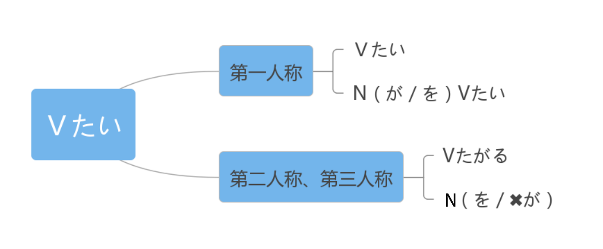

# Vたい<愿望>

- <grammer-content sentence="意义：表示说话人的愿望。**派生一类形容词**；" />
- <grammer-content sentence="接续：**动词第一连用形(ます形去ます)** + たい；" />
- 译文：想...；想要...(进行某个动作)。

::: warning 注意

1. `非过去时`一般只能用于`第一人称`，用于`非第一人称`时需要使用 `派生动词「Vたがる」的形式或相应地改变形态`；
2. 当V是`他动词`时，其「を」格补足语`可以用「が」格替换`；
3. 但派生动词 `「Vたがる」` 的「を」格补足语`不可以用「が」格替换`。

总结如下图所示：

:::

::: info 例句

1. <grammer-content sentence="おみやげが**[買/か]いたいです**。" trans="我想买点儿土特产。" />
2. <grammer-content sentence="[有名/ゆうめい]な[大学/だいがく]に**[入/はい]りたいです**。" trans="我想进名校。" />
3. <grammer-content sentence="[今日/きょう]はあの[人/ひと]に**[会/か]いたくありません**。" trans="今天不想见那个人。" />
4. <grammer-content sentence="[父/ちち]は[新/あたらしい]パソコンを**[買/か]いたがっています**。" trans="爸爸想换台新电脑。" />
5. <grammer-content sentence="[小学校/しょうがっこう]のときの[先生/せんせい]が[会/か]いに[来/き]ましたが、そのとき[田中/やまだ]さんはいませんでした。[先生/せんせい]は[田中/やまだ]さんに**[会/か]いたがっていました**。" trans="小学那会儿的老师来了，但那时田中不在。老师想见田中。" />

:::

::: tip 补充

<grammer-content sentence="1. 询问对方的愿望时，使用「Vたいですか」有时显得不礼貌，这种场合下一般可以用「～はどうですか」或者「～はいかがですか」等表达方式。" />

  <grammer-content sentence="[趙/ちょう]さん、コーヒーは**どうですか／いかがですか**。" trans="老赵，喝咖啡不？" />

<grammer-content sentence="2. 非自主动词一般不能接「～たい」。" />

  1. <grammer-content sentence="[早/はや]くできたいです。 ❌" />
  2. <grammer-content sentence="[日本語/にほんご]がわかりたいです。 ❌" />

:::
