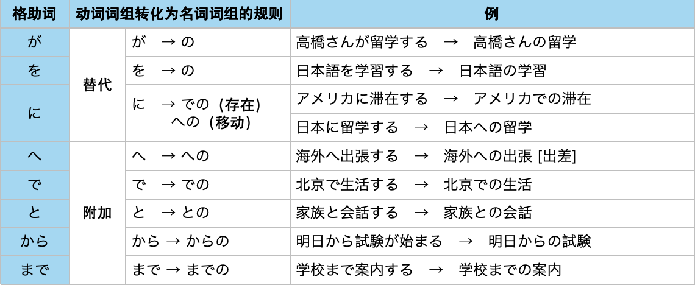

# Ｎ1（＋格助词）＋の＋Ｎ2＜动词词组名词化＞

- 意义：动词词组名词化；
- <grammer-content sentence="接续：Ｎ1（＋格助词）＋の＋**动作性意义的名词**Ｎ2；" />
- 译文：...的...

::: tip 说明

动词词组中的格（连用格）转化为名词词组中的连体格，其变化规则如下：

:::

::: info 例句

1. <grammer-content sentence="**[三保/みほ]さんとの[相互学習/そうごがくしゅう]**はとてもよかったです。" trans="跟三保的相互学习真的太好了。" />
2. <grammer-content sentence="**[日本語/にほんご]への[翻訳/ほんやく]**は[難/むずか]しいです。" trans="翻译成日语很难。" />
3. <grammer-content sentence="**[海外/かいがい]からの[観光客/かんこきゃく]**が[増/ふ]えている。" trans="来自境外的旅客在增加。" />

:::

::: tip 补充

<grammer-content sentence="如果词义中暗含“**买给他人，物品转移给接受方**”的对象义和移动义，也可以用**「～への + N」**来表达，例如「～へのお[土産/みやげ]」「～への[手紙/てがみ]」等。" />

  <grammer-content sentence="**[家族/かぞく]と[友達/ともだち]へのおみやげ**がほしいんです。" trans="我想要带给家人和朋友的礼物。" />

:::
