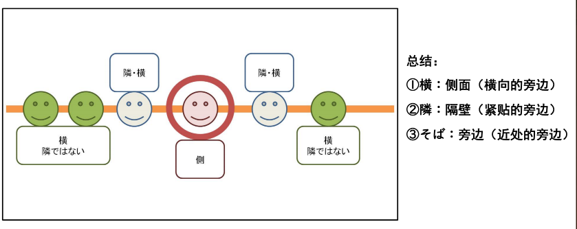

# 方位处所词

下表罗列了常用的一些方位处所词，如有其他，欢迎补充~

| 词 | 音型 | 译文 |
| :-----------: | :-----------: | :-----------: |
| <grammer-content sentence="[上/うえ]" inline />  | ②⓪ | 上 |
| <grammer-content sentence="[下/した]" inline />  | ② | 下 |
| <grammer-content sentence="[右/みぎ]" inline />  | ⓪ | 右 |
| <grammer-content sentence="[左/ひだり]" inline />  | ⓪ | 左 |
| <grammer-content sentence="[前/まえ]" inline />  | ① | 前 |
| <grammer-content sentence="[後ろ/うしろ]" inline />  | ⓪ | (场所)后 |
| <grammer-content sentence="[中/なか]" inline />  | ① | 中间，里面 |
| <grammer-content sentence="[外/そと]" inline />  | ① | 外 |
| <grammer-content sentence="そば" inline />  | ① | 旁边 |
| <grammer-content sentence="[横/よこ]" inline />  | ⓪ | 侧面，旁边 |
| <grammer-content sentence="[隣/となり]" inline />  | ⓪ | 旁边，隔壁 |
| <grammer-content sentence="[周り/まわり]" inline />  | ⓪ | 周围 |
| <grammer-content sentence="[間/あいだ]" inline />  | ⓪ | ......之间 |
| <grammer-content sentence="[真ん中/まんなか]" inline />  | ⓪ | 正中间 |
| <grammer-content sentence="[中心/ちゅうしん]" inline />  | ⓪ | 中心 |
| <grammer-content sentence="[角/かど]" inline />  | ① | 拐角，角落 |
| <grammer-content sentence="[辺/へん]/[辺り/あたり]" inline />  | ⓪/① | 周边，周围 |
| <grammer-content sentence="[-側/-がわ]" inline />  | ⓪ | .....侧 |
| <grammer-content sentence="[東/ひがし]" inline />  | ⓪ | 东 |
| <grammer-content sentence="[西/にし]" inline />  | ⓪ | 西 |
| <grammer-content sentence="[南/みなみ]" inline />  | ⓪ | 南 |
| <grammer-content sentence="[北/きた]" inline />  | ②⓪ | 北 |
| <grammer-content sentence="[北西/ほくせい]" inline />  | ⓪ | 西北 |
| <grammer-content sentence="[北東/ほくとう]" inline />  | ⓪ | 东北 |
| <grammer-content sentence="[南東/なんとう]" inline />  | ⓪ | 东南 |
| <grammer-content sentence="[南西/なんせい]" inline />  | ⓪ | 西南 |
| <grammer-content sentence="[向こう/むこう]" inline />  | ②⓪ | 对面；远方；对方 |
| <grammer-content sentence="[向かい/むかい]" inline />  | ⓪ | （正）对面 |

## 横・隣・そば 的区別

可以通过下图感受下三者在方位上的区别：

