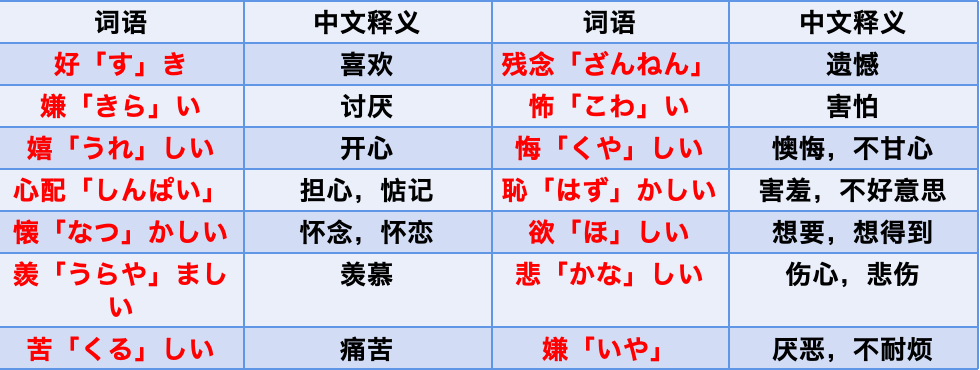

# 感情、感觉形容词

<grammer-content sentence="指表示人的**心理或生理状态**的形容词。感情形容词作**谓语的句子**一般**主语多为第一人称**，且经常**省略**。" />
<grammer-content sentence="感情的对象、诱因等一般用**「が」**标记，构成「（私は）Nが～」的句式。" />
<grammer-content sentence="**非过去时陈述句**的情况下，当**第二或第三人称做主语**时，做谓语的感情形容词要采用特定的形式，如可以在形容词词干的后面接构词后缀**「-がる」**使之动词化。" />

::: info :books: 例句

1. <grammer-content id='term-1-11-1-0' sentence="[本当/ほんとう]ですか？！**うれしい**！[演目/えんもく]は[何/なん]ですか。" trans="真的吗? 太好了，剧目是什么。" />
2. <grammer-content id='term-1-11-1-1' sentence="[朝/あさ]から[目/め]**が[痛/いた]い**です。" trans="我眼睛从早上疼到现在。" />
3. <grammer-content id='term-1-11-1-2' sentence="[日本人/にほんじん]の[友達/ともだち]**が[欲/ほ]しい**です。" trans="我想有个日本朋友。" />

:::

::: tip :bookmark: 补充

<grammer-content sentence="描述**第三人称**高兴的状态时可以使用「[嬉/うれし]い」的派生动词「[嬉/うれし]がる」或感情动词「[喜/よろこ]ぶ」，但**前者多含贬义色彩**，「[喜/よろこ]ぶ」的感情色彩则是中性的。" />

  <grammer-content id='term-1-11-1-3' sentence="そんなに**[嬉/うれし]がらない**で、まだまだ[早/はや]いよ。" trans="别高兴得太早了。" />
  <grammer-content id='term-1-11-1-4' sentence="[大学/だいがく]に[入/はい]ることができましたね。ご[両親/りょうしん]も**[喜/よろこ]んでいる**でしょう。" trans="你考上大学了啊。你父母也很高兴吧。" />

日语中常见的感情形容词如下：

<grammer-content sentence="其中，「[好/す]き」和「[嫌/きら]い」虽然也是感情类形容词，但是在使用时**不受人称限制。无论描述第几人称，都不需要改变形态**。" />

:::
